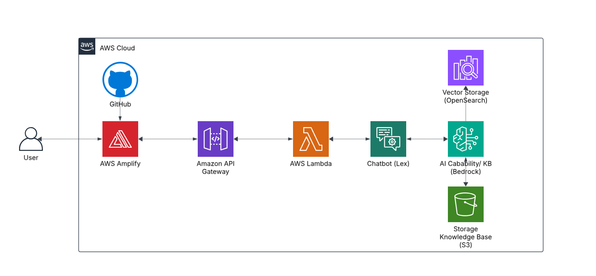
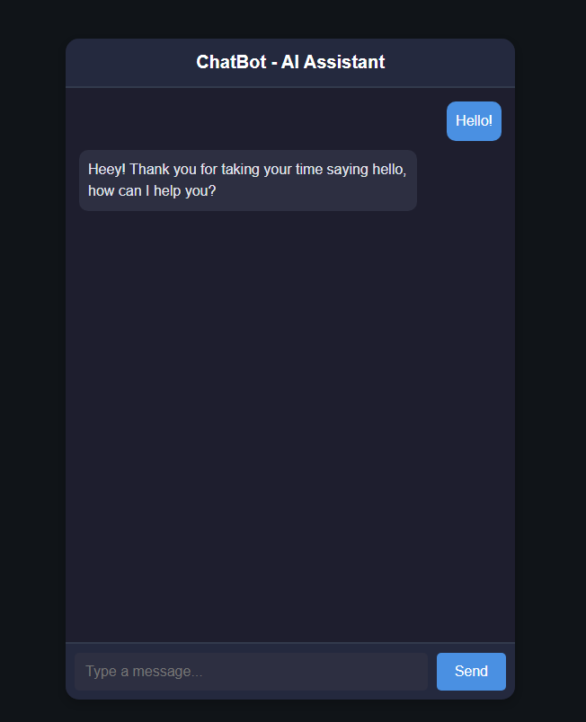
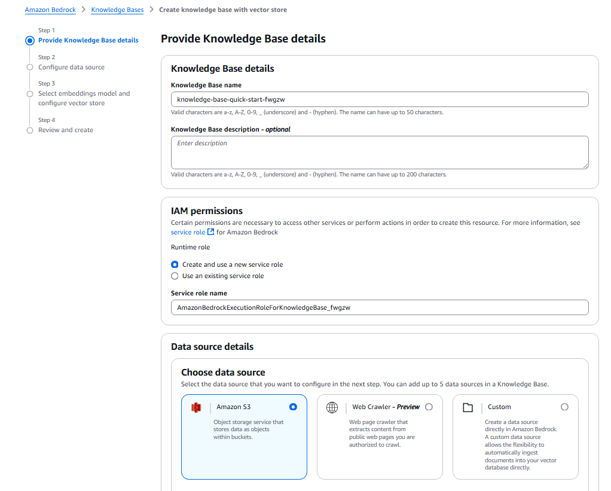

# **AWS Chatbot**  

Hello everyone! This is a personal project showcasing **AWS Services** creating a **ChatGPT alike project, only using AWS services!** This project consists of the following services:  

- **AWS Amplify** (Host website)  
- **Amazon API Gateway**  
- **AWS Lambda** - (Function to process requests)  
- **Amazon Lex** (AI chatbot)  
- **Amazon Bedrock** (AI Capability to be like ChatGPT)  
- **Amazon OpenSearch Service** (Vector storage for the AI)  
- **Amazon Simple Storage Service (S3)** (Used for knowledge base)  

  

The final product should be like this:  

  

---

## **🚀 Prerequisites**  
1. **AWS Account** (Sign up at [aws.amazon.com](https://aws.amazon.com))  
2. **IAM Role with Lambda & Lex permissions**  
3. **Amazon Lex Bot**  
4. **AWS CLI installed** (For deployment)  
5. **Time and commitment!**  

---

## **📌 STEP-BY-STEP PROJECT:**  

### **📌 1. Setup Amazon S3 (Knowledge Base)**  

- Go to **AWS Console → S3**.  
- Click **"Create Bucket"**.  
- Choose a **unique Bucket Name** (e.g., chatbot-knowledge-base).  
- Keep the bucket **private**.  
- Upload any **documents or knowledge bases** for AI retrieval.  

✅ **Done! Your AI bot will use this bucket to retrieve knowledge.**  

---

### **📌 2. Enable AI Capabilities (Amazon Bedrock)**  

#### **Step-by-Step Setup**  

- Go to **AWS Console → Amazon Bedrock**.  
- Click **"Access Models"** and **register for AI models**.  
- Once approved, click **"Create Knowledge Base"**.  

  

- Select the **S3 bucket** created earlier.  
- Click **"Create Knowledge Base"** to generate vector embeddings. Doing this will create **an OpenSearch Service**, which is a **storage for vectors for the AI**.  
- **Amazon OpenSearch Service** will be created **automatically**.  

⚠️ **Warning:** If left running for too long, **OpenSearch incurs costs**. Disable after testing.  

✅ **Now your chatbot can retrieve relevant knowledge from documents!**  

---

### **📌 3. Create Amazon Lex Chatbot**  

#### **Step-by-Step Lex Setup**  

- Go to **AWS Console → Amazon Lex**.  
- Click **"Create Bot" → "From Scratch"**.  
- Set:  
  - **Bot Name:** `LexChatBot`  
  - **Alias:** `TSTALIASID`  
  - **Language:** `en_US`  
- **Create Intent #1**: `WelcomeIntent`  
  - **Response:** `"Hello! How can I help you?"`  
- **Create Intent #2**: `AIResponseIntent`  
  - Use **Amazon AI Services** to generate responses.  
- **Deploy the bot** and note:  
  - **Bot ID:** `BOT_ID`  
  - **Alias ID:** `TSTALIASID`  
- **Update the Lambda function** to include these IDs.  

✅ **Lex is now configured and ready!**  

---

### **📌 4. Create AWS Lambda Function**  

- Go to **AWS Console → Lambda**.  
- Click **"Create Function"**.  
- **Function Name:** `chatbotFunction`  
- **Runtime:** `Python 3.9+`  
- Attach an **IAM Role** with:  
  - **AmazonLexFullAccess**  
  - **AWSLambdaBasicExecutionRole**
  - **AmazonBedrockFullAccess (Allows interaction with AI models)**
- Copy and paste `lambda_function.py` code (from this repo) into your **Lambda function**.  
- Click **Deploy**.  

✅ **Lambda is now set up to process chatbot messages.**  

---

### **📌 5. 🔌 Configure API Gateway**  

#### **Step-by-Step API Setup to Connect API Gateway with Lambda**  

- Go to **AWS Console → API Gateway**.  
- Click **"Create API" → "HTTP API"**.  
- Choose **"Build"** and select **HTTP API**.  
- Under **Integrations**, select **"Add Integration"** and choose **AWS Lambda**.  
- Choose the **Lambda function** you created earlier.  
- Click **Next** and configure a **New Route**:  
  - **Method:** `POST`  
  - **Path:** `/chatbot` (or any path you'll like)  
- Click **Next** and review the stage settings (**default is dev**).  
- Click **Deploy API** and **copy the Invoke URL**.  

---

### **📌 Enable CORS (Cross-Origin Resource Sharing)**  

- Go to **Routes → Select `/chatbot`**.  
- Click **CORS Configuration** and add:  
  - **Allowed Origins:** `*`  
  - **Allowed Methods:** `POST`  
  - **Allowed Headers:** `Content-Type`  
- Click **Save Changes** and **redeploy the API**.  

---

### **📌 Adding IAM Permissions for API Gateway to Invoke Lambda**  

⚠️ **This was one of the hardest parts to troubleshoot!**  
API Gateway **needs permission** to invoke **Lambda**, which requires adding an **IAM policy**.  

- Go to **AWS IAM → Roles**.  
- Find the **role associated with API Gateway**.  
- Click **Attach Policies** and add:  
  - **AWSLambdaRole**  
  - **AWSLambdaBasicExecutionRole**  
  - **AmazonAPIGatewayInvokeFullAccess** (**Allows API Gateway to invoke Lambda**)  
- Click **Save** and **Redeploy API Gateway**.  

✅ **Now, the URL is what you'll copy for the API URL in `index.html` to retrieve the AI data from the website.**  

✅ **Example API URL:**  
https://your-api-id.execute-api.us-east-1.amazonaws.com/dev/chatbot

---

### **📌 6. 🌍 Deploy the Chatbot Website (AWS Amplify)**  

- Go to **AWS Console → Amplify**.  
- Click **"New App" → "Host Web App"**.  
- Choose **GitHub as Source**.  
- Select your **repository and branch**.  
- Deploy the **index.html** file.  
- **Edit `index.html`** to update the **API Gateway URL** with your actual endpoint. 
- All of the JavaScript scripts, CSS designs and the website design it's inside of the same HTML file for simplification purposes.  

✅ **Your chatbot website is now hosted and accessible online!**  

---

### **🎉 Congratulations! Your AWS Chatbot is Live!** 🚀  

This chatbot uses:  
- **Amazon S3** for storing knowledge bases  
- **AWS Lambda** for backend processing  
- **Amazon Bedrock + Lex** for AI responses  
- **API Gateway** to connect everything  
- **AWS Amplify** for website hosting  

🚀 **Now you can customize and expand your chatbot as needed!**  

